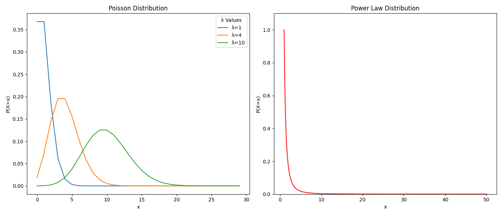

# 公式

**平均度**：网络中所有节点的度的平均值称为网络的的平均度记为 $$\langle k \rangle$$
$$
\langle k \rangle = \frac{2M}{N}
$$
**网络密度**：一个包括N个节点的网络密度定义为网络实际存在边数M与最大可能的边数之比
$$
\rho = \frac{M}{\frac{1}{2} N (N - 1)}
$$
**平均路径长度**：网络的平均路径长度定义为任意两个节点之间距离的平均值
$$
L = \frac{1}{\frac{1}{2}N(N - 1)}\
$$
**聚类系数**：

# 2. 网络与图

## 网络的图表示

### 简单图

假设图 $$G = (V, E)$$ 是一个定点数为N，边数为M得到简单无向图。由于任意两个顶点之间之多有一条边，则
$$
0 \le M \le \frac{N(N - 1)}{2}
$$
在相同情况的有向图，可能存在两条相反的的边，则
$$
0 \le M \le N(N - 1)
$$
简单图的极端情形有**空图**和**完全图**。

# 3. 网络基本拓扑性质

## 节点的度与网络稀疏性

### 度与平均度

无向网络中节点i的度k_i定义为与节点直接相连的边的数目。所有节点的度的平均值称为网络的平均度，记作`<k>`。

给定网络G的邻接矩阵 $$A = (a_{ij})_{N \times N}$$，则有
$$
k_i = \sum_{j = 1}^Na_{ij} = \sum_{j = 1}^Na_{ji} \\
\langle k \rangle = \frac{1}{N}\sum_{i=1}^Nk_i = \frac{1}{N}\sum_{i,j=1}^Na_{ij}
$$
网络节点的度与网络边数M之间有如下关系
$$
2M = N\langle k \rangle = \sum_{i = 1}^Nk_i = \sum_{i, j = 1}^Na_{ij}
$$
亦有
$$
M = \frac{1}{2}N \langle k\rangle = \frac{1}{2}\sum_{i = 1}^Nk_i = \frac{1}{2}\sum_{i,j = 1}^{N},\\
\langle k \rangle = \frac{2M}{N}
$$

## 平均路径长度与直径

### 无权无向网络情形

**平均路径长度**，网络中两个节点i和j的最短路径，也成为测地路径，指连接这两个节点边数最少的路径。节点i和j之间的**距离$$d_{ij}$$**定义为连接这两个节点的最短路径上的数目。

网络的平均路径长度（Average path length）L定义为任意两个节点之间的距离的平均值。其中N为网络节点数，网络的平均路径长度也称为网络的**特征路径长度**或**平均距离**。
$$
L = \frac{1}{\frac{1}{2}N(N - 1)}\sum_{i \ge j}d_{ij}
$$
 **网络直径**，网络中任意两个节点之间的距离最大值为网络的**直径**，即
$$
D = \underset{i,j}{max}d_{ij}
$$

### 加权有向图网络情形

求解加权有向网络上两点之间最短路径的经典算法时Dijkstra算法。该算法可以计算从一个源节点s到网络中所有其他节点的最短路径，其基本思想时为每个节点v保留到目前为止所找到的从节点s到节点v的最短路径。

*以节点s为起点，利用贪心算法不断扩大最小距离节点集合。*

## 聚类系数

### 无权无向网络情形

聚类系数描述了紧密连接成都，是形成簇的指标。假设网络中节点i的度为k_i，即它有k_i个直接有边相连的邻居节点。网络中一个度为k_i的节点i的聚类系数C_i定义为
$$
C_i = \frac{E_i}{(k_i(k_i - 1))/2} = \frac{2E_i}{k_i(k_i - 1)}
$$
其中 E_i 是节点i的k_i个邻接点之间实际存在的边数。

## 度分布

### 度分布的概念

从概率统计的角度看，p_k 可以视为网络中一个随机选择的节点的度的概率。而有向网络的**出度分布**和**入度分布**。

### 从钟形曲线到长尾分布

泊松分布满足
$$
P(k) = \frac{\lambda^k e^{-\lambda}}{k!}
$$
其中参数 $$\lambda > 0$$。泊松分布的均值和方差都是 $$\lambda$$，且随着其增大，分布的形状迅速接近正态曲线。

与钟形分布存在一个明显的特征不同，长尾分布往往不存在单一的特征标度，因此也称为**无标度分布（Scale-free distribution）**。

# 4. 度相关性与社团结构

## 度相关性与同配性

### 联合概率分布

$$P(j, k)$$ 为网络中度为j的节点和度为k的节点之间的边数占网络总边数的比例
$$
P(j, k) = \frac{m(j, k) \mu(j, k)}{2M}
$$
其中
$$
\mu(j, k) = \begin{cases}
1, j \ne k \\
2, j = k
\end{cases}
$$
$$m(j, k)$$ 是度为j的节点和度为k的节点之间的连变数

余度分布
$$
P_n(k) = \sum_{j = k_{min}}^{k_{max}} P(j, k)
$$
其中 $$k_min$$ 和 $$k_max$$ 分别是网络中节点的度的最大值和最小值。

### 余平均度

条件概率 $$P_c(j | k)$$
$$
P_c(j | k) P_n(k) = P(j, k)
$$
计算度为k的节点的邻居节点的平均度，也成为度为k的节点的余平均度，记为<k_{nn}>
$$
\langle k_{nn}\rangle_i = \frac{1}{k_i}\sum_{i = 1}^{k_i} k_{i_j}
$$

# 5. 节点重要性与相似性

## 无向网络节点重要性指标

### 度中心性

在社会网络分析中，常用**中心性**来表示节点在网络中的位置。一个节点的度越大就意味着这个节点越重要。一个包含N个节点的网络中，节点最大可能的度值为N - 1，通常为便于比较而对中心性指标做**归一化处理**，度为 k_i 的节点的归一化的度中心性值定义为
$$
{DC}_i = \frac{k_i}{N - 1}
$$

### 介数中心性

以经过某个节点的最短路径的树木来刻画节点重要性的指标就成为**介数中心性**，简称**介数**（BC）。具体的，节点i的介数定义为
$$
BC_i = \sum_{s \ne i, i \ne t} \frac{n^i_{st}}{g_{st}}
$$
其中，$$g_{st}$$ 为从节点s到节点t的最短路径的数目，$$n^i_{st}$$ 为从节点s到节点t的g_{st}条最短路径中经过节点i的最短路径的数目。

### 接近中心性

对于网络中的每一个节点i，可以计算该节点到网络中所有节点的距离的平均值，记为d_i
$$
d_i = \frac{1}{N} \sum_{j = 1}^N d_{ij}
$$
其中d_{ij}是节点i到节点j的距离，这样就得到网络平均路径长度的另一种计算公式
$$
L = \frac{1}{N} \sum_{i = 1}^N d_i
$$
d_i值的大小也在某种程度上反映了节点i在网络中的相对重要性，我们把d_i的倒数定义为节点i的**接近中心性**，简称**接近数**，用记号CC_i来表示
$$
CC_i = \frac{1}{d_i} = \frac{N}{\sum_{j = 1}^N d_{ij}}
$$

### 特征向量中心性

一个节点的重要性即取决于其邻居节点的数量，也取决于其邻居节点的重要性，记x_i为节点i的重要性度量值，那么应该有
$$
x_i = c\sum_{j = 1}^N a_{ij} x_j
$$
其中c为一比例常数，$$A = (a_{ij})$$仍然是网络的邻接矩阵，记 $$x = \begin{bmatrix}x_1 & x_2 & ... & x_N\end{bmatrix}^T$$，则可以得到下式，意味着 $$\mathbf{x}$$ 是矩阵 $$\mathbf{A}$$ 与特征值 $$c^{-1}$$ 对应的的特征向量，故此称为特征向量中心性，计算向量$$\mathbf{x}$$ 的一个基本方法就是给定初值 $$\mathbf{x}(0)$$，然后采用迭代算法
$$
\mathbf{x} = c\mathbf{A}\mathbf{x}
$$

## 权威值和枢纽值HITS算法

### HITS算法描述

记 $$A = {(a_{ij})}_{N \times N}$$ 为有向网络对应的邻接矩阵。

初始：设定网络中所有节点的**权威值**和**枢纽值**的初始值

迭代过程：在第k步进行如下三种操作

1. 权威值校正规则：每一个节点的权威值校正为指向它的节点的枢纽值之和
   $$
   x'i(k) = \sum_{j = 1}^N a_{ij} y_j (k - 1)
   $$

2. 枢纽值校正规则：每一个节点的枢纽值校正为它所指向的所有节点的权威值之和
   $$
   y'_i(k) = \sum_{j = 1}^N a_{ij} x'_j(k)
   $$

3. 归一化
   $$
   x_i(k) = \frac{x'_i(k)}{\Vert x'(k)\Vert} \\
   y_i(k) = \frac{y'_i(k)}{\Vert y'(k)\Vert}
   $$
   

## PageRank算法

### 基本算法

PageRank算法的基本想法是：WWW上一个页面的重要性取决于指向它的其他页面的**数量**与**质量**。

首先给定所有结点的初始PageRank值，$$PR_i(0)$$，i为节点序号，并且满足 $$\sum_{i = 1}^N PR_i(0) = 1$$，然后把每个节点的PR值平均封给它所指向的节点。也就是说下一轮的PR值由指向他的节点加权所决定，式中 $$a_{ji}$$ 代表两个节点是否连接。
$$
PR_i(k) = \sum_{j = 1}^N a_{ji} \frac{PR_j(k - 1)}{k_j^{out}}
$$

在有向网络的邻接矩阵 $$A = (a_{ij})_{N \times N}$$ 基础上定义基本Google矩阵 $$\overline{A} = (\overline{a}_{ij})_{N \times N}$$​
$$
a_{ij} =
\begin{cases}
1/k_i^{out},&\text{如果有从i指向j的边} \\
0, &\text{否则}
\end{cases}
$$
那么基本的PageRank矫正规则可以写为如下矩阵形式
$$
PR(k) = \bar{A}^T PR(k - 1)
$$
并且有 $$\left \Vert PR(k) \right \Vert_1 = 1, \forall k \geq0$$。

### PageRank算法

修正的PageRank算法，我们假设：这类页面链接到集合中所有的网页（不管它们是否相关），使得这类网页的PR值将被所有网页均分。对于这种残差概率，我们引入阻尼系数 d，并声明 d=0.85，其意义是：任意时刻，用户访问到某页面后继续访问下一个页面的概率，相对应的 1−d=0.15 则是用户停止点击，随机浏览新网页的概率。d 的大小由一般上网者使用浏览器书签功能的频率的平均值估算得到。
$$
PR_i(k) = s \sum_{j = 1}^{N} \bar{a}_{ji} PR_j(k - 1) + \frac{1 - s}{N}
$$

# 6. 随机网络模型

## 规则网络

### 常见规则网络

**全局耦合网络**，如果一个网络中任意两个节点之间都有边直接相连，那么称该网络为一个全局耦合网络。

**最近耦合网络**，如果一个网络中，每一个节点只和它周围的邻居节点相连，那么就称该网络为最近耦合网络。

### 基本拓扑性质

**全局耦合网络**具有最多的边数，最大的聚类系数 $$C_{gc} = 1$$ 和最小的平均路径长度 $$L_{gc} = 1$$。

**最近耦合网络**的聚类系数为
$$
\begin{aligned}
C_{nc} & = \frac{3 \times (网络中三角形的数目)}{网络中连通三元组的数目} \\
& = \frac{3(K - 2)}{4(K - 1)}
\end{aligned}
$$
该网络的平均路径长度为
$$
L_{nc} = \frac{N}{2K}
$$

## 随机图

### 模型描述

**固定边数的ER随机图G(N, M)**

**固定连边概率的ER随机图G(N, p)**

### 拓扑性质

$$ER随机图的期望边数 = p \cdot C_n^2$$

**边数分布**，给定网络节点数N和连边概率p，生成的随机图恰好具有M条边的概率为标准的二项分布

# 7. 小世界模型

## 网络模型

### WS小世界模型构造

在一个含有N个节点的环状最近邻耦合网络，其中每个节点都与他左右相邻的K/2个节点相连，K是偶数。**随机化重连**，以概率p随机重新连接网络中原有的每条边，其中规定不得有重边和自环。

在WS小世界中，每条边是否被重连是一次独立的伯努利试验，成功概率为p，则随机重连的边的期望为
$$
E = M \cdot p = \frac{N k}{2} \cdot p
$$

### NW小世界模型构造

从规则图开始，给定一个含有N个节点的环状最近邻耦合网络，其中每个节点都与她左右相邻的各K/2各节点相连，K是偶数，**随机化加边**，以概率p在随机选取的NK/2对节点之间添加边，其中规定不得有重边和自环。

# 8. 无标度网络模型

## BA无标度网络模型

**实际网络的两个重要特性**

1. 增长特性：网络规模是不断扩大的
2. 优先连接：新的节点更倾向于与那些具有较高连接的hub节点相连接

### 模型描述

**增长**，从一个具有 $$m_0$$ 个节点的联通网络开始，每次引入一个新的节点并且连到 $$m$$ 个已存在的节点上，这里 $$m \le m_0$$。**优先连接**，一个新的节点与一个已存在的节点 i 相连接的概率 $$\Pi_i$$ 与节点i的度 $$k_i$$ 之间满足如下关系
$$
\Pi_i = \frac{k_i}{\Sigma_j k_i}
$$

### 幂律度分布

BA模型具有幂律度分布且与参数m和网络规模N无关。
$$
P(k) = \frac{\partial P(k_i(t) < t)}{\partial k} = 2m^2 \frac{t}{m_0 + t}\frac{1}{k^3}
$$

